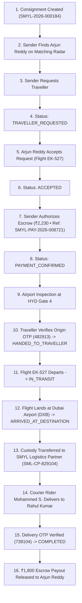

# SMYL Global — Operational Workflow Specification

> **Transaction Focus**: Master Transaction `SMYL-2026-000184`  
> **Lifecycle Pattern**: State-Machine Driven Finite Workflow  

---

## 1. Overview of the End-to-End Lifecycle

The SMYL Global platform operates as a unified logistics and luggage marketplace. Rather than treating sender, traveller, and receiver interactions as disjointed screens, every action drives the progression of a single synchronized transaction.

---

## 2. Phase-by-Phase Technical Breakdown

### Phase 1: Shipment Creation & Traveller Matching
1. **Creation**:
   - The Sender (Lakshmi Narayana) specifies parcel weight (2.0 KG), contents (*Pashmina Shawls & Traditional Sweets*), declared value (₹8,000), pickup city (Hyderabad, India), and destination (Downtown Dubai, UAE).
   - System calculates estimated pricing: ₹1,800 (Luggage Reward) + ₹180 (SMYL Platform Fee) + ₹250 (Last-mile Courier Fee) = **₹2,230**.
   - Initial State: `TransactionStatus.openForMatching`.
2. **Matching Engine**:
   - The radar queries active flights departing Hyderabad (HYD) arriving in Dubai (DXB) with at least 2.0 KG of available baggage capacity.
   - Verified traveller **Arjun Reddy** (Flight `EK-527`, 4.8★ rating, KYC verified) is identified with a 96% match score.
   - Sender submits request, transitioning state to `TransactionStatus.travellerRequested`.

---

### Phase 2: Traveller Acceptance & Escrow Authorization
1. **Acceptance**:
   - Arjun Reddy receives an immediate dispatch card on the Traveller dashboard with flight details and earning preview (₹1,800 payout).
   - Upon clicking `Accept Request`, the state transitions to `TransactionStatus.accepted`.
2. **Escrow Payment**:
   - The Sender interface prompts the user to lock funds securely in escrow.
   - Dual payment options are presented:
     - **UPI VPA Input**: Regex validation ensures `@bank` or `@provider` compliance with quick-select chips.
     - **Dynamic QR Code**: Displays real-time 5-minute countdown and transaction metadata.
   - Upon payment authorization, a digital receipt with reference `SMYL-PAY-2026-008721` is generated, and the status transitions to `TransactionStatus.paymentConfirmed`.
   - **Escrow Rule**: Funds remain in trust; no money is released to the traveller until final verified delivery.

---

### Phase 3: Origin Airport Handover & Flight Transit
1. **Origin Handover Protocol**:
   - Both parties meet at the designated airport location: **Rajiv Gandhi Int'l Airport (HYD), Departure Gate 4**.
   - The physical package and security seals are inspected by Arjun Reddy.
   - The Sender provides secret Origin Handover OTP: `482913`.
   - The Traveller enters the OTP into the application.
   - Upon cryptographic validation, state transitions to `TransactionStatus.handedToTraveller`.
2. **Flight Operations**:
   - **Departure**: Arjun records departure (`Take Off`), transitioning state to `TransactionStatus.inTransit`.
   - **Arrival**: Upon landing at Dubai International (DXB Terminal 3), Arjun taps `Record Landing`, transitioning state to `TransactionStatus.arrivedAtDestination`.

---

### Phase 4: Onward Courier Transfer & Final Delivery
1. **Logistics Partner Handoff**:
   - Because the delivery address is in Downtown Dubai/Abu Dhabi, onward transit is handled by **SMYL Logistics Partner**.
   - Custody is transferred at DXB Cargo Village under Partner Tracking ID **`SML-CP-829104`**.
   - Status updates to `TransactionStatus.withCourierPartner` and then `TransactionStatus.outForDelivery` when assigned to rider **Mohammed S.** (`+971 52 881 2940`).
2. **Receiver Verification & Escrow Settlement**:
   - The Receiver (Rahul Kumar) inspects the parcel seals.
   - The Receiver shares secret Delivery OTP: `739104`.
   - The OTP is verified in the system:
     - Status transitions to `TransactionStatus.delivered` / `TransactionStatus.completed`.
     - The escrow hold of ₹1,800 is instantly released to Arjun Reddy's wallet.
     - An immutable audit trail entry is recorded for financial compliance.
